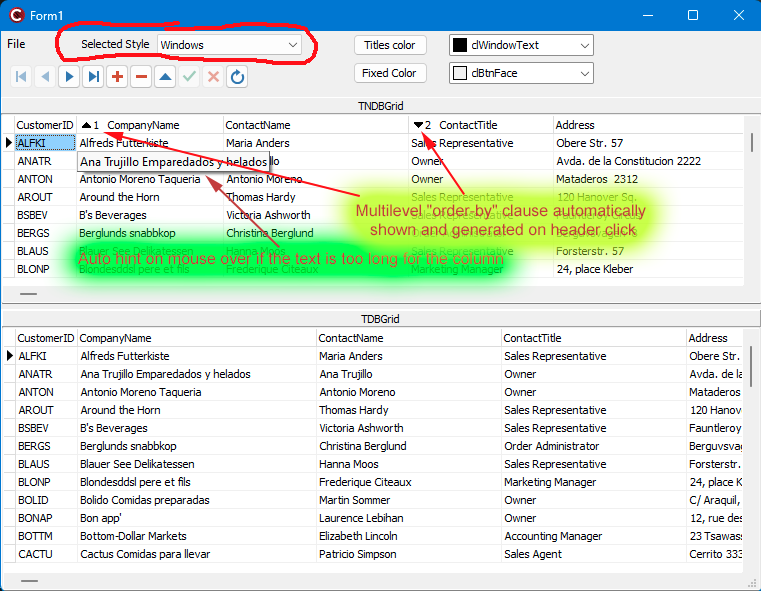
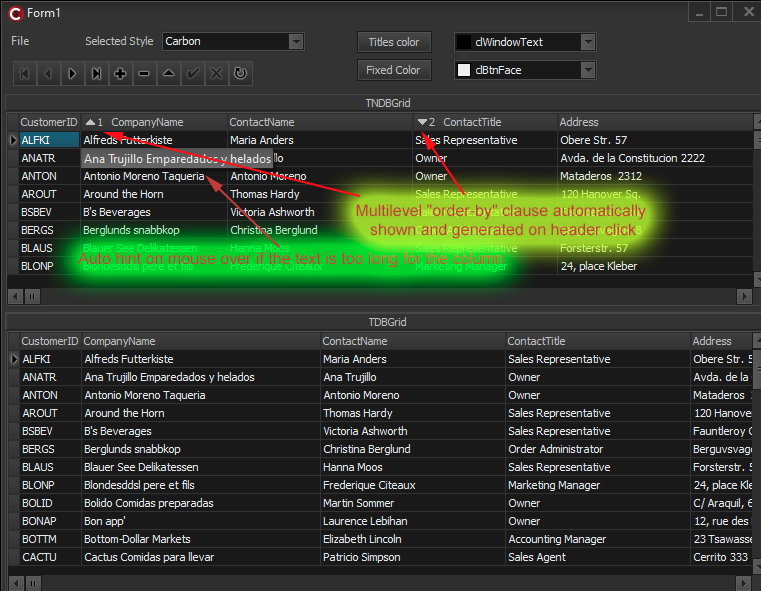

# NDBGRID
## Enhanced TDBGrid for VCL applications 

Please, ensure to add macro $(AUTO) to Environment variables override according to platform's number (i.e. 270 for Sydney, 280 for Alexandria, etc.)

## Some interesting features:

- Automatic generation of the ORDER BY clause by (clickable) column headers configuration
- Automatic tooltip expansion (on mouse over) when the field value doesn't fit in the column width
- Some useful events was added 
- VCL styles are supported
- ...

</a>

</a>
