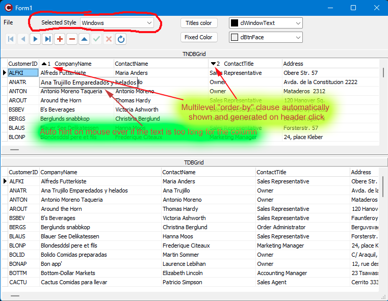
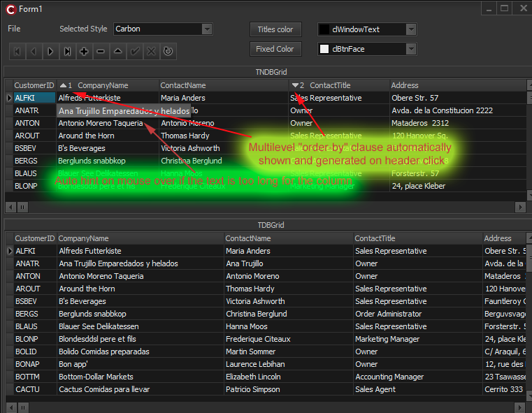

# NDBGRID
## Enhanced TDBGrid for VCL applications 

The component is maintained as a Delphi codebase in [`Delphi`](./Delphi).
The Delphi runtime package is configured with `DCC_CBuilderOutput=All`, so
building it also generates the C++Builder consumption artifacts (`.hpp`,
`.bpi`, `.lib`, `.a`). The same Delphi design-time package registers
`TNDBGrid` in the IDE for both Delphi and C++Builder personalities.

## Installation

Use the installer under `Delphi` for your RAD Studio version:

- `Delphi\install_12.bat`
- `Delphi\install_13.bat`

Those scripts:

- build the Delphi runtime/design packages
- register the design-time package in the IDE
- add the `Delphi` source folder to the IDE library path

After installation, restart RAD Studio. `TNDBGrid` should then be available
from the Tool Palette in both Delphi and C++Builder.

## Paths 

Includes:
```
<repo>\Delphi
```

Libraries:
```
$(BDSCOMMONDIR)\Bpl
$(BDSCOMMONDIR)\Bpl\$(Platform)
```

## Some interesting features:

- Automatic generation of the ORDER BY clause by (clickable) column headers configuration
- Automatic tooltip expansion (on mouse over) when the field value doesn't fit in the column width
- Some useful events were added 
- VCL styles are supported
- ...

</a>

</a>

